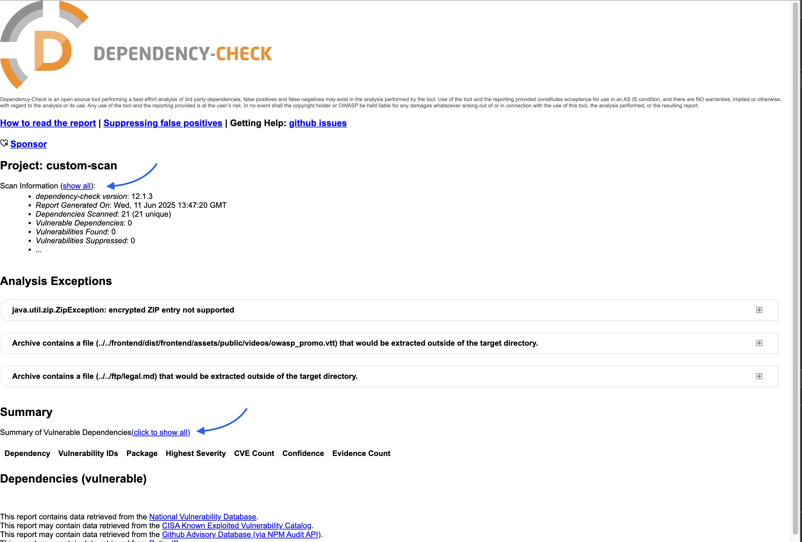
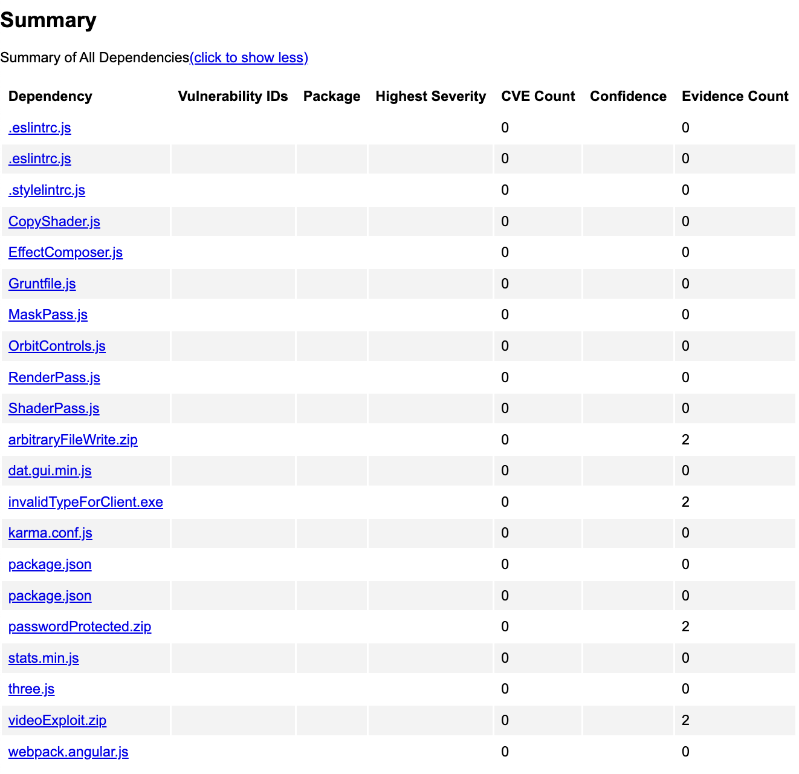

# OWASP Dependency-Check: Software Composition Analysis (SCA)

> A flexible and automated environment to scan any codebase for known vulnerabilities using OWASP Dependency-Check, powered by Docker Compose.

---

## 🎯 Objectives

- Use OWASP Dependency-Check to scan custom source code
- Generate both machine-readable (JSON) and human-readable (HTML) reports
- Understand how to integrate Software Composition Analysis into the Secure Software Development Lifecycle (SDLC)

---

## 🧰 Technologies Used

- Docker & Docker Compose
- OWASP Dependency-Check
- Bash / Shell

---

## 🚀 Quickstart with Docker Compose

### 📦 Prerequisites

- Docker installed
- Docker Compose installed

### 🗂️ Prepare your project

Place any source code you want to scan inside the `src/` folder (e.g. Node.js, Java, Python projects).

You can also clone the Juice Shop sample project:

```bash
git clone https://github.com/juice-shop/juice-shop.git src
```

### ▶️ Run the scan

```bash
docker compose up
```

> [!NOTE]
> If the `src/` folder is empty, you’ll get a warning or empty report.

This will:

1. Scan the contents of the `src/` directory
2. Generate a full Software Composition Analysis report
3. Output results to the `reports/` folder

> [!WARNING]
> The first run may take a while to download CVE data. Subsequent scans will be faster.

> [!TIP]
> Use an NVD API Key in CI/CD pipelines to improve performance and reduce sync time.

---

## 📁 Report Files

After the scan completes, check the `reports/` directory for:

- 📄 `dependency-check-report.html` — human-readable HTML report
- 📄 `dependency-check-report.json` — machine-readable JSON report

### Open the HTML report in your browser

```bash
open reports/dependency-check-report.html       # macOS
xdg-open reports/dependency-check-report.html   # Linux
start reports/dependency-check-report.html      # Windows (Git Bash)
```

### Sample Report



Vulnerable Summary:



---

## 🔄 SDLC Integration: Best Practice

| SDLC Phase     | SCA Integration Strategy                                              |
| -------------- | --------------------------------------------------------------------- |
| **Plan**       | Define policies for third-party components and licensing.             |
| **Develop**    | Run local scans before pushing code (e.g., CLI or pre-commit hook).   |
| **Build/Test** | Automate SCA in CI/CD pipelines (GitHub Actions, GitLab CI, Jenkins). |
| **Release**    | Block releases if critical vulnerabilities are found.                 |
| **Deploy**     | Use signed and audited dependencies in production.                    |
| **Operate**    | Monitor for new CVEs affecting deployed components.                   |

> 🔐 **Pro Tip**: Automate `dependency-check` in your CI pipelines for continuous feedback.

---

## 🧪 CI/CD Pipeline Integration

To automate Software Composition Analysis in your DevSecOps workflow, check out the detailed guide:

👉 [SCA CI/CD Pipeline Guide](./SCA-ci-pipeline.md)

---

## 💡 Troubleshooting

- Ensure the `src/` folder contains valid source code (e.g. with `package-lock.json`, `pom.xml`, etc.)
- To re-run the scan manually:

```bash
docker compose run --rm dependency-check
```

- To stop and clean up:

```bash
docker compose down
```

---

## 📚 Learn More

- [OWASP Dependency-Check](https://owasp.org/www-project-dependency-check/)
- [Docker Compose](https://docs.docker.com/compose/)
- [National Vulnerability Database (NVD)](https://nvd.nist.gov/)

---

## 👨‍💻 Author

Henry Manke – [hm-co.de](https://hm-co.de)
